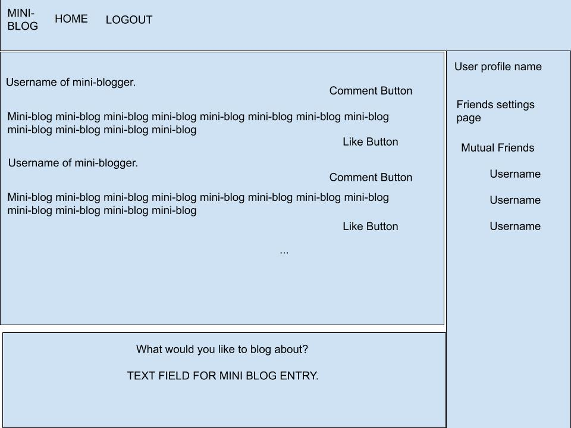
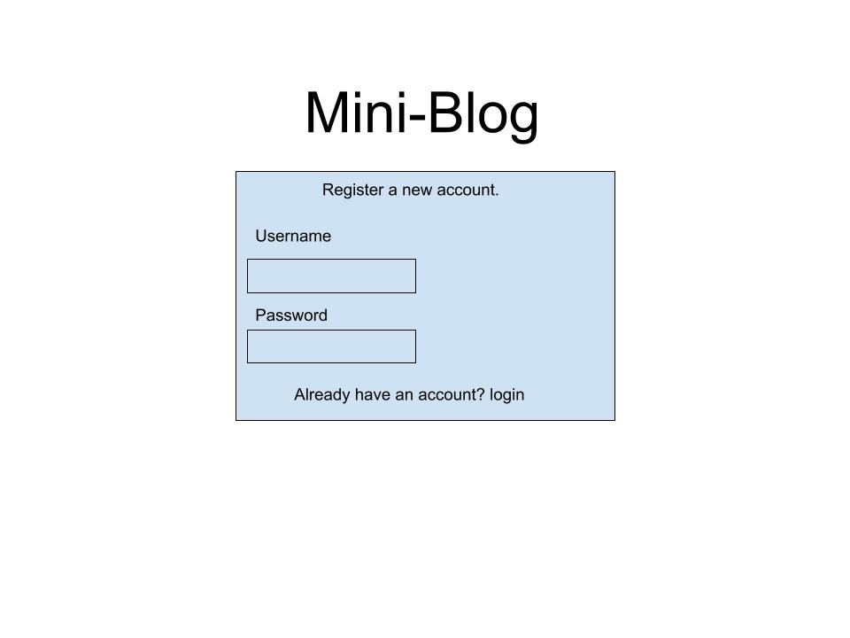
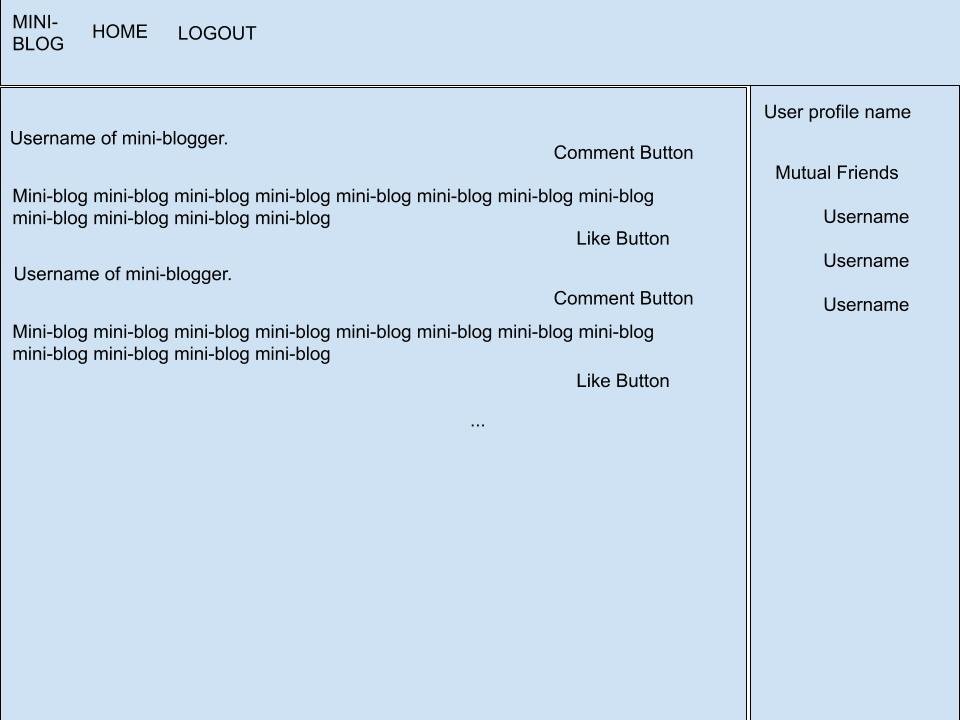
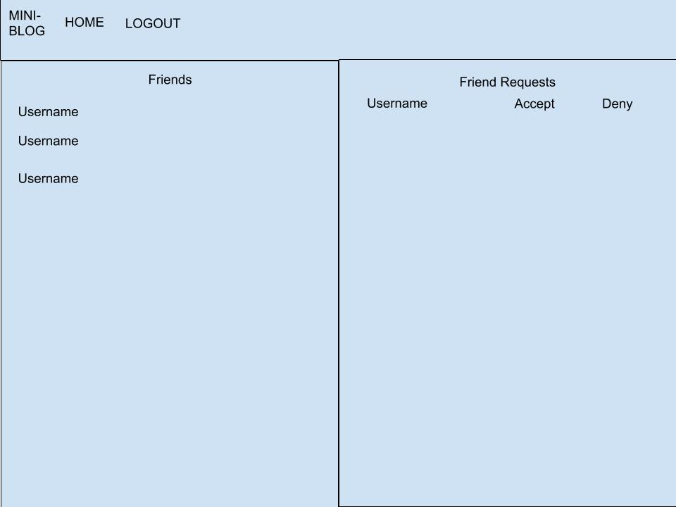

# Project Planning
For this assignment, you'll create some initial plans for your project.

## Assignment Description
[Project Planning Assignment](https://education.launchcode.org/liftoff/modules/assignments/project-planning)

## Submission Instructions

### Wireframes
This will be the homepage if a user is logged in.

This will be the login/register screen.

This will be the User profile page.

This will be the friends setting page.

### Project Tracker

https://trello.com/b/w7JfMN0d/twitter-clone

### Project Repo Link

https://github.com/DanFilla/Mini-Blog

